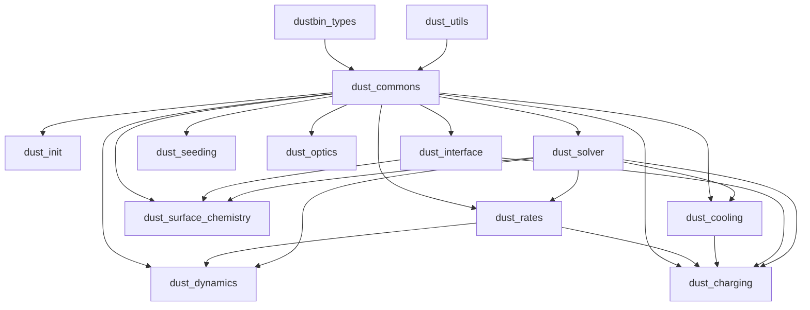

# CALIMA dust module layout

This folder contains the CALIMA dust and PAH physics used by RAMSES. The code is split into small modules so that shared state, table loading, physics kernels, and runtime wrappers stay separate.

## Module hierarchy

The practical layering is:

1. dustbin_types defines the derived types used everywhere else.
2. dust_utils provides generic interpolation and helper routines.
3. dust_commons holds the shared dust and PAH parameters, bin properties, counters, and global switches.
4. The physics modules build on that shared state: dust_rates, dust_charging, dust_surface_chemistry, dust_dynamics, dust_cooling, dust_optics, and dust_seeding.
5. dust_init performs startup validation and table loading.
6. dust_interface exposes the dust helper routines used by the RTZ cooling path.
7. dust_solver is the main time-integration driver for dust chemistry.

## File guide

| File | Purpose |
| --- | --- |
| dustbin_types.f90 | Defines the core derived types: DustTable, DustChemistryInfo, DustBin, and PAHBin. Also provides init/reset methods for the reusable dust chemistry workspace. |
| dust_utils.f90 | Generic helpers used throughout CALIMA, including search/interpolation routines, turbulence utilities, and small math helpers. |
| dust_commons.f90 | Central shared module for dust/PAH flags, namelist-controlled parameters, per-bin properties, global counters, and helper data used by the rest of CALIMA. |
| dust_rates.f90 | Computes the characteristic timescales for dust and PAH processes: accretion, sputtering, coagulation, shattering, RATD, sublimation, evaporation, freezing, and related update switches. |
| dust_charging.f90 | Implements dust charge distributions and mean charge estimates, plus Coulomb focusing helpers and charge-state mixing routines. |
| dust_surface_chemistry.f90 | Handles H2 formation on dust grains, sticking and recombination efficiencies, and related surface chemistry fits. |
| dust_dynamics.f90 | Provides grain relative velocities and dust destruction in shocks, including PAH-specific shock destruction. |
| dust_cooling.f90 | Computes dust collisional heating/cooling, including the BH80 low-temperature branch and its cached prefactors. |
| dust_photophysics.f90 | Module dust_optics. Reads dust and PAH optical tables, dielectric tables, and stores the cross-section data in dust bin structures. |
| dust_seeding.f90 | Supplies dust and PAH source terms from stellar ejecta and winds, using limiting-element logic for condensation. |
| dust_init.f90 | Startup module for CALIMA. It validates the namelist, builds dust and PAH bin metadata, allocates the shared dust workspace, loads tables, initializes caches, and prints the active configuration. |
| dust_interface.f90 | Thin public wrapper layer for radiative dust work. It computes local anisotropy, radiative rates, precooling terms, and the combined dust cooling interface used by RTZ. |
| dust_solver.f90 | Main chemistry solver. It decides whether dust should be updated, computes timescales, advances dust and PAH abundances, and accumulates process counters. |

## External wiring

The CALIMA modules are not standalone. They are pulled into the RAMSES startup and cooling paths from outside this folder.

1. hydro/read_hydro_params.f90 reads the calima_params namelist when CALIMA is enabled. That is where the dust and PAH switches, bin properties, models, timescales, and external table directory are set from input.
2. hydro/read_hydro_params.f90 also calls check_params_dust so incompatible dust configurations fail before the run starts.
3. amr/init_time.f90 calls init_CALIMA_dust during startup. That routine is where the dust bin metadata is built, the reusable dust_helper workspace is allocated, the dust and PAH tables are loaded, and the BH80 cache is initialized.
4. rtz/rtz_cooling_module.f90 resets dust_helper for each cell, fills it with the current dust and PAH state, and then calls compute_dust_rad_rates and compute_dust_precool in the CALIMA branch of the cooling step.
5. rtz/rtz_coolrates_module.f90 calls compute_dust_coolrates through dust_interface so dust contributions are included in the cooling-rate solve.
6. hydro/cooling_fine.f90 enables CALIMA-specific helpers in the cooling operator-splitting path, including the turbulence sigma helper from dust_utils.

## Runtime flow

The typical order is:

1. Parameters are read from the namelist.
2. CALIMA configuration is validated.
3. init_CALIMA_dust builds the dust and PAH bin structures and loads the tables.
4. During each cooling update, the current cell state is copied into dust_helper.
5. dust_interface and dust_solver compute the radiative, collisional, chemical, and destruction terms.
6. The updated dust, PAH, and gas quantities are written back to the hydro and RT state.

## Notes

- The dust optical tables are read from the directory given by dust_tables_dir.
- The shared per-rank chemistry workspace is the DustChemistryInfo instance dust_helper.
- Most CALIMA routines depend on dust_commons for bin metadata and on dustbin_types for the storage layout of tables and helper arrays.

## Dust dynamics (TVA)

`dust_tva=.true.` advects the dust bins relative to the gas at the terminal velocity
(Lebreuilly+2019), as an operator-split upwind step applied to `unew` after the Godunov sweep
(`amr_step.f90`, `dust_diffusion_fine` / `dust_push_fine`). Things to be aware of:

- **PAH bins do not drift.** `dust_upwind_correct1/2` loop over the `ndust` dust bins only; the
  `npah` PAH bins stay perfectly coupled to the gas. `compute_gas_dust_radpressure_acc` does return
  a PAH acceleration, but it is not used, and PAH mass is excluded from `eps_tot` and from the
  barycentric acceleration. Defensible for PAHs, which are small and well coupled, but it is an
  approximation, not an accident. `check_params_dust` warns when `npah > 0` and TVA is on.
- **Gas-phase metals do not follow the dust.** Only the `ndust` density scalars are advected;
  `imetal` is untouched. Dust carrying C/O/Mg/Si/Fe across a cell boundary does not move the
  corresponding gas-phase element, so the per-element budget drifts over time. Watch the
  `dust_log` mass-conservation output.
- **`tva_wmax_cs`** caps `|w_drift|` at that multiple of the local sound speed, in both
  `get_dust_courant_dt` and the flux routines. TVA assumes Stokes << 1, which fails once the drift
  approaches `c_s`; since `t_s ~ 1/rho_gas`, a single hot/diffuse cell would otherwise drive the
  global timestep to zero. Set `<= 0` to disable (not recommended). Clipping is counted and
  reported alongside the "dust drift sets dt" message.
- **Enabling TVA changes the pure hydro** even before any drift matters: `ctoprim`
  (`hydro/umuscl.f90`) and `cmpdt` (`hydro/courant_fine.f90`) switch the EoS from the mixture
  density to the gas density `rho_mix*(1-eps_tot)`. A TVA run is therefore not bit-comparable to
  the same setup with TVA off.
- **`condinit_kind`** values `dustydiffuse`, `dustyshock`, `dustyblast1d`, `dustyspress` and
  `dustygauss` select **test** branches that hardcode the stopping time and/or the thermodynamics.
  These are resolved once into `tva_test_mode` at startup and warned about. Production ICs must use
  a different `condinit_kind` (the default `region`).