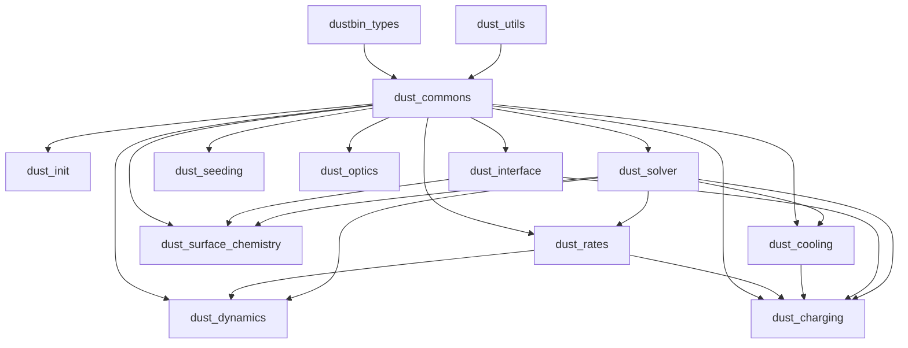

# CALIMA dust module layout

This folder contains the CALIMA dust and PAH physics used by RAMSES. The code is split into small modules so that shared state, table loading, physics kernels, and runtime wrappers stay separate.

## Module hierarchy



The practical layering is:

1. dustbin_types defines the derived types used everywhere else.
2. dust_utils provides generic interpolation and helper routines.
3. dust_commons holds the shared dust and PAH parameters, bin properties, counters, and global switches.
4. The physics modules build on that shared state: dust_rates, dust_charging, dust_surface_chemistry, dust_dynamics, dust_cooling, dust_optics, and dust_seeding.
5. dust_init performs startup validation and table loading.
6. dust_interface exposes the dust helper routines used by the RTZ cooling path.
7. dust_solver is the main time-integration driver for dust chemistry.

## File guide

| File | Purpose |
| --- | --- |
| dustbin_types.f90 | Defines the core derived types: DustTable, DustChemistryInfo, DustBin, and PAHBin. Also provides init/reset methods for the reusable dust chemistry workspace. |
| dust_utils.f90 | Generic helpers used throughout CALIMA, including search/interpolation routines, turbulence utilities, and small math helpers. |
| dust_commons.f90 | Central shared module for dust/PAH flags, namelist-controlled parameters, per-bin properties, global counters, and helper data used by the rest of CALIMA. |
| dust_rates.f90 | Computes the characteristic timescales for dust and PAH processes: accretion, sputtering, coagulation, shattering, RATD, sublimation, evaporation, freezing, and related update switches. |
| dust_charging.f90 | Implements dust charge distributions and mean charge estimates, plus Coulomb focusing helpers and charge-state mixing routines. |
| dust_surface_chemistry.f90 | Handles H2 formation on dust grains, sticking and recombination efficiencies, and related surface chemistry fits. |
| dust_dynamics.f90 | Provides grain relative velocities and dust destruction in shocks, including PAH-specific shock destruction. |
| dust_cooling.f90 | Computes dust collisional heating/cooling, including the BH80 low-temperature branch and its cached prefactors. |
| dust_photophysics.f90 | Module dust_optics. Reads dust and PAH optical tables, dielectric tables, and stores the cross-section data in dust bin structures. |
| dust_seeding.f90 | Supplies dust and PAH source terms from stellar ejecta and winds, using limiting-element logic for condensation. |
| dust_init.f90 | Startup module for CALIMA. It validates the namelist, builds dust and PAH bin metadata, allocates the shared dust workspace, loads tables, initializes caches, and prints the active configuration. |
| dust_interface.f90 | Thin public wrapper layer for radiative dust work. It computes local anisotropy, radiative rates, precooling terms, and the combined dust cooling interface used by RTZ. |
| dust_solver.f90 | Main chemistry solver. It decides whether dust should be updated, computes timescales, advances dust and PAH abundances, and accumulates process counters. |

## External wiring

The CALIMA modules are not standalone. They are pulled into the RAMSES startup and cooling paths from outside this folder.

1. hydro/read_hydro_params.f90 reads the calima_params namelist when CALIMA is enabled. That is where the dust and PAH switches, bin properties, models, timescales, and external table directory are set from input.
2. hydro/read_hydro_params.f90 also calls check_params_dust so incompatible dust configurations fail before the run starts.
3. amr/init_time.f90 calls init_CALIMA_dust during startup. That routine is where the dust bin metadata is built, the reusable dust_helper workspace is allocated, the dust and PAH tables are loaded, and the BH80 cache is initialized.
4. rtz/rtz_cooling_module.f90 resets dust_helper for each cell, fills it with the current dust and PAH state, and then calls compute_dust_rad_rates and compute_dust_precool in the CALIMA branch of the cooling step.
5. rtz/rtz_coolrates_module.f90 calls compute_dust_coolrates through dust_interface so dust contributions are included in the cooling-rate solve.
6. hydro/cooling_fine.f90 enables CALIMA-specific helpers in the cooling operator-splitting path, including the turbulence sigma helper from dust_utils.

## Runtime flow

The typical order is:

1. Parameters are read from the namelist.
2. CALIMA configuration is validated.
3. init_CALIMA_dust builds the dust and PAH bin structures and loads the tables.
4. During each cooling update, the current cell state is copied into dust_helper.
5. dust_interface and dust_solver compute the radiative, collisional, chemical, and destruction terms.
6. The updated dust, PAH, and gas quantities are written back to the hydro and RT state.

## Notes

- The dust optical tables are read from the directory given by dust_tables_dir.
- The shared per-rank chemistry workspace is the DustChemistryInfo instance dust_helper.
- Most CALIMA routines depend on dust_commons for bin metadata and on dustbin_types for the storage layout of tables and helper arrays.

## Dust dynamics (TVA)

`dust_tva=.true.` advects the dust bins relative to the gas at the terminal velocity
(Lebreuilly+2019), as an operator-split upwind step applied to `unew` after the Godunov sweep
(`amr_step.f90`, `dust_diffusion_fine` / `dust_push_fine`). Things to be aware of:

- **PAH bins do not drift.** `dust_upwind_correct1/2` loop over the `ndust` dust bins only; the
  `npah` PAH bins stay perfectly coupled to the gas. `compute_gas_dust_radpressure_acc` does return
  a PAH acceleration, but it is not used, and PAH mass is excluded from `eps_tot` and from the
  barycentric acceleration. Defensible for PAHs, which are small and well coupled, but it is an
  approximation, not an accident. `check_params_dust` warns when `npah > 0` and TVA is on.
- **Gas-phase metals do not follow the dust.** Only the `ndust` density scalars are advected;
  `imetal` is untouched. Dust carrying C/O/Mg/Si/Fe across a cell boundary does not move the
  corresponding gas-phase element, so the per-element budget drifts over time. Watch the
  `dust_log` mass-conservation output.
- **`tva_wmax_cs`** caps `|w_drift|` at that multiple of the local sound speed, in both
  `get_dust_courant_dt` and the flux routines. TVA assumes Stokes << 1, which fails once the drift
  approaches `c_s`; since `t_s ~ 1/rho_gas`, a single hot/diffuse cell would otherwise drive the
  global timestep to zero. Set `<= 0` to disable (not recommended). Clipping is counted and
  reported alongside the "dust drift sets dt" message.
- **Enabling TVA changes the pure hydro** even before any drift matters: `ctoprim`
  (`hydro/umuscl.f90`) and `cmpdt` (`hydro/courant_fine.f90`) switch the EoS from the mixture
  density to the gas density `rho_mix*(1-eps_tot)`. A TVA run is therefore not bit-comparable to
  the same setup with TVA off.
- **`condinit_kind`** values `dustydiffuse`, `dustyshock`, `dustyblast1d`, `dustyspress` and
  `dustygauss` select **test** branches that hardcode the stopping time and/or the thermodynamics.
  These are resolved once into `tva_test_mode` at startup and warned about. Production ICs must use
  a different `condinit_kind` (the default `region`).

## Trapped IR radiation pressure on the dust

RAMSES-RT splits IR radiation pressure into two complementary channels whose sum is a single force
(Rosdahl & Teyssier 2015, eq. B8):

```
kappa_R rho F / c  =  kappa_R rho F_s / c  -  (1/3)(c~/c) grad(E_t)
   (total IR)            (streaming)            (trapped / diffusion)
```

The streaming half is the ordinary flux term, computed per bin in `dust_radpressure.f90`. The
trapped half lives in the `NENER` slot `iIRtrapVar`, so the Godunov solver already applies
`-grad(P_trap)/rho_mix` to the **mixture barycentre**. Physically that force acts on the dust,
which carries the IR opacity, so TVA adds the *differential* part to the drift driver:

```
D_k += - grad(P_trap) * ( s_k/rho_k - 1/rho_mix ),   s_k = chi_R,k / chi_R,tot
```

using `P_trap = (gamma_rad-1)*E_trap`, deliberately the same expression the Riemann solver uses so
the barycentric part cancels exactly. Things to be aware of:

- **IR opacities are the T_rad-dependent means, not the band-weighted ones.** For the IR group,
  `group_cs*_dust/pah` are the wrong spectral weight (they are averaged over the group band with a
  1e5 K blackbody or the stellar SED). The IR column of `csr_dust`/`csa_dust` is therefore
  overridden per substep in `cool_step` with the Rosseland (flux) and Planck (absorption) means at
  the local radiation temperature, from `dustbins_props(k)%Rosseland_tab`/`%Planck_tab` and the new
  per-charge-state PAH equivalents. This is CALIMA's analogue of RAMSES-RT's `is_kIR_T`, taken from
  the real grain optics instead of a `kappa ~ T_rad^2` power law. The same cross sections feed the
  TVA force, the trapping optical depth and `s_k`, so the channels cannot disagree at `tau_c ~ 1`.
- **`D_k` is proportional to `1/rho_k`, which is a destabilising feedback**: a dust-poor cell drifts
  faster and evacuates further. In a real run it self-regulates, because `tau propto chi_R propto
  rho_d`, so as dust leaves, `f_trap = exp(-1/tau) -> 0` and the force switches itself off. If you
  prescribe `E_trap` externally (as `condinit_kind='dustyirtrap'` does) that regulation is absent,
  which is why that test asserts the first-step drift rather than multi-step advection.
- **The trapped-IR flux is anti-diffusive, so boundary blemishes grow.** For a single bin the mass
  flux is `F = rho_d w_d = (-grad P_trap) t_s (1 - eps)^2`, which *decreases* with `rho_d`
  (measured `dF/drho_d ~ -1.9e-3 < 0`) even though `w_d > 0`. The flux routine picks the donor cell
  on `sign(w_face)`, i.e. on the material velocity, which is the opposite of this flux's
  characteristic direction. A perturbation therefore grows instead of damping. In
  `tests/dust_tva/dustyirtrap` the seed is the domain boundary: the zero-gradient ghost fill makes
  the centred difference effectively one-sided there, so the two edge cells get
  `grad(P_trap) = -5e-6` instead of `-1e-5` — exactly half — which is an O(1) error in their drift.
  A 2*dx cell-to-cell mode then eats inward from both boundaries (reaching x ~ 7.5 of a 10 pc box
  by t = 0.27), while the interior between the fronts stays smooth at the 1e-4 level. See
  `dustyirtrap_runaway.png`. The halved edge gradient is ordinary RAMSES zero-gradient BC behaviour
  and affects the pre-existing `grad(P_gas)` term identically; what is specific to the trapped-IR
  term is `dF/drho_d < 0`, which converts that blemish into a growing mode.
  **Open question for production:** there `E_trap` is not independent of the dust, since
  `tau propto chi_R propto rho_d` makes `f_trap = exp(-1/tau)` increase with `rho_d`, which may
  well restore `dF/drho_d > 0` and with it the correct upwind direction. That could not be tested
  here because the RTZ chemistry path stalls (see the plan notes), so it is unverified. If it turns
  out `dF/drho_d < 0` in a real run, the trapped-IR contribution to the dust flux should be
  upwinded on the characteristic direction, or given a Rusanov/LLF flux instead.
### Tests

| test | what it checks |
| --- | --- |
| `tests/dust_tva/dustyirtrap` | the trapped-IR drift term in isolation, against a closed form, over 2 decades of `rho_d`. Freezes `P_trap`, so it asserts the FIRST step only. |
| `tests/dust_tva/dustyslab` | the full UV -> IR -> trapped chain with the real chemistry: UV injected at the left edge streams through dust-poor gas, is absorbed in a dust slab at 3-7 pc, and is reprocessed into the IR. |

`dustyslab` has three namelists. A resolved UV attenuation front and
IR-optically-thick cells cannot coexist: with `kappa_UV/kappa_R ~ 1e2-1e4` and
`L_slab/(1.5 dx) ~ 34`, the two optical depths are locked together as
`tau_UV(slab) ~ (kappa_UV/kappa_R) * (L_slab/1.5dx) * tau_cell,IR`, i.e. a
factor 5e3 at best. Any appreciable trapping therefore forces the UV to be
absorbed in a small fraction of a cell. The three namelists pick points along
that line:

| namelist | rho_gas [g/cm3] | tau_UV(slab) | tau_cell,IR | achieved f_trap |
| --- | --- | --- | --- | --- |
| `dustyslab.nml` | 1e-22 | 3.5 | 3e-11 | 0 |
| `dustyslab_dense.nml` | 1.23e-17 | 4.3e5 | 0.055 | 9e-9 |
| `dustyslab_sil.nml` | 2.59e-18 | 2.3e3 | 0.14 | **4.7e-4** |

- `dustyslab.nml` -- the fiducial case. `tau_UV = 3.5` with an e-folding length
  of 15 cells, so the attenuation front is well resolved and matches
  `exp(-tau)` to 10%; the direct UV acceleration collapses 29x across the slab
  and the reprocessed IR peaks inside it. No trapping at all. Also shows the
  radiation-driven dust push: the illuminated face is ablated from ~0.25 Myr.
  `tend=2` Myr, ~45 s.
- `dustyslab_dense.nml` -- 5 decades denser. Reaches `tau_cell = 0.055`, so the
  trapped fraction is still only 9e-9: useful as the UV-thick limit, but it does
  NOT exercise the trapped-IR channel. `tend=0.5` Myr, ~20 s.
- `dustyslab_sil.nml` -- **the variant that actually exercises trapping**, and
  the least extreme one that can. Two changes do the work: the slab is moved to
  bin 3 so it uses the 0.005 um silicate table, whose `kappa_UV` is 38x below
  the 0.01 um graphite of bin 1 (`condinit_kind='dustyslabsil'`, `NDUST=3`,
  `NDCHEMTYPE=2`); and the UV flux is raised to 1.5e13 ph/cm2/s, which warms the
  grains to `T_rad = 33 K` where `kappa_R = 15` instead of ~1. Since
  `kappa_R ~ T_rad^2` and `T_rad ~ F^(1/4)`, `tau_cell ~ F^(1/2)`, so flux is a
  cheaper lever than density. Result: `P_trap` reaches 1.4 in code units, the
  trapped-IR acceleration exceeds the streaming UV by ~100x at the illuminated
  face, and the achieved trapped fraction matches RT15 eq. 50 to **11%**
  (`median achieved/predicted = 0.89`). `tend=0.5` Myr, ~20 s.

`plot-dustyslab.py` takes the namelist and, optionally, the bin index carrying
the slab: `python3 plot-dustyslab.py dustyslab_sil.nml 3`. It reads the RT
output by staging a scratch copy with `rt_*` renamed to `hydro_*`, so shared
`visu_ramses` is untouched.

Two traps to avoid when interpreting these:

- **`kappa_R` must be taken at the local `T_rad`, not at a nominal 30 K.** The
  code uses `T_rad = (E_IR*f_c/a_r)^(1/4)`, and with a reduced light speed the
  `f_c` factor pulls `T_rad` down hard -- to 3.3 K in the dense variant, where
  the Rosseland mean sits in the sub-mm and `kappa_R = 1.2` rather than 22.
  Assuming 30 K overestimates `tau_cell` by ~15x and will make you think
  trapping is active when it is not.
- **Use the Rosseland table the code writes** (`SEDtables/rosseland_mean_DustBin_NN.list`)
  rather than re-integrating the harmonic mean yourself; an independent
  re-integration differed by ~2x, which is enough to move `f_trap = exp(-1/tau)`
  by two orders of magnitude.

Two things worth knowing when reading these:

- **Run only as long as the comparison is valid.** The radiation field reaches
  steady state in ~2 hydro steps (~0.07 Myr; `median |dF/F| ~ 2e-3` between
  0.068 and 0.102 Myr). The dust then starts to move: in the fiducial variant
  `t_s = 5.3 kyr` and `w_d = 0.23 pc/Myr`, so the illuminated face is ablated
  from ~0.25 Myr and `tau_UV` has halved by 2 Myr. Analytic comparisons must
  therefore be made on an early snapshot, which is what `plot-dustyslab.py`
  does; later snapshots are for the dynamics only.
- **The UV band is 5-7 eV deliberately.** That is below every ionisation
  threshold RTZ tracks (Mg 7.65, Fe 7.9, Si 8.15, C 11.26, H 13.6 eV), so
  `group_csn` is identically zero and the gas is transparent -- `group_csn` is
  overwritten at `rt/rt_init.f90:470` and cannot simply be zeroed from the
  namelist. Note also that `rt_n_bound` injects only into rtvar 1, i.e. group 1,
  which `rt_isIR` reserves for the IR, so the UV inflow is a thin `rt_nsource`
  region at x=0 with `rt_src_group=2`.

**Watch the grain size against the optical tables.** They are matched to bins by
index alone (`averaged_cross_section_DustBin_<NN>.txt`), with no check against
the namelist `asize`. The shipped tables are 0.01 um graphite, 0.1 um graphite,
0.005 um silicate, 0.1 um silicate -- which matches `dustyshell_mulbin`'s
4-bin `asize` list, but a single-bin run must use `asize=0.01d0` to match
`DustBin_01`. `dustyspress.nml` sets `asize=0.1d0` with `NDUST=1`, so every
kappa there is wrong by ~1000x (m_grain scales as a^3). With the size matched,
CALIMA's `kappa_R` at 30 K is 0.22 cm2/g_gas against RT15's 0.28 -- good
agreement.

- Note also that a *discontinuous* prescribed `E_trap` (e.g. a linear ramp with periodic
  boundaries, which does not wrap) produces a large spurious `grad(P_trap)` at the seam and
  destabilises the run outright.
- **The drift can be large by construction**: a ~1% dust mass fraction absorbs ~100% of the IR
  momentum, so `w ~ t_s |grad P_trap| / rho_d`. At `tau_IR ~ 1` this is tens of km/s, well outside
  the `Stokes << 1` regime TVA assumes, so `tva_wmax_cs` will clip. Watch `tva_nclip`.
- **PAHs contribute to `chi_R,tot` but do not drift**, so their share of the trapped force simply
  stays on the barycentre. The TVA closure conserves barycentric momentum regardless.
- Requires `NENER>=1`, `rt_isIR`, `NDUST>0` and `rt_flux_scheme='glf'` (RT15 footnote 3 — the
  trapped/streaming partition is matched to the GLF numerical diffusion, so HLL is inconsistent).
  `check_params_dust` enforces all four.